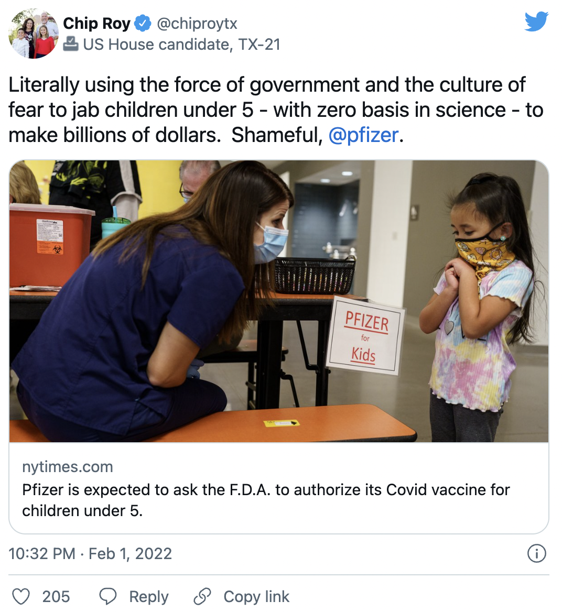
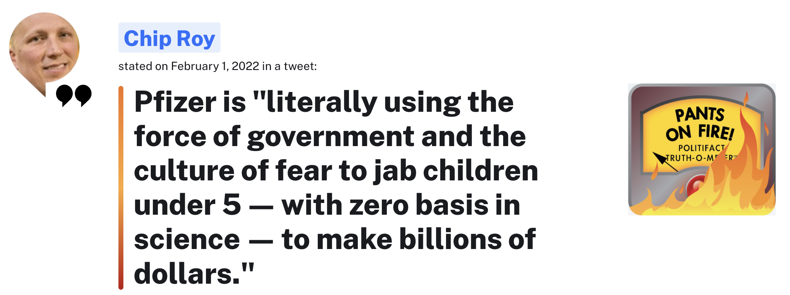
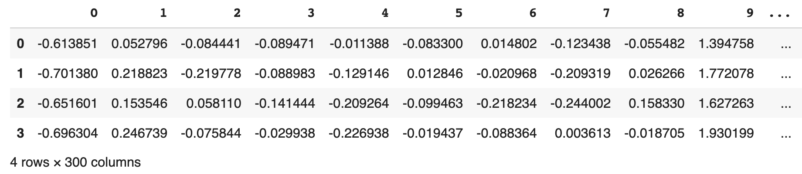
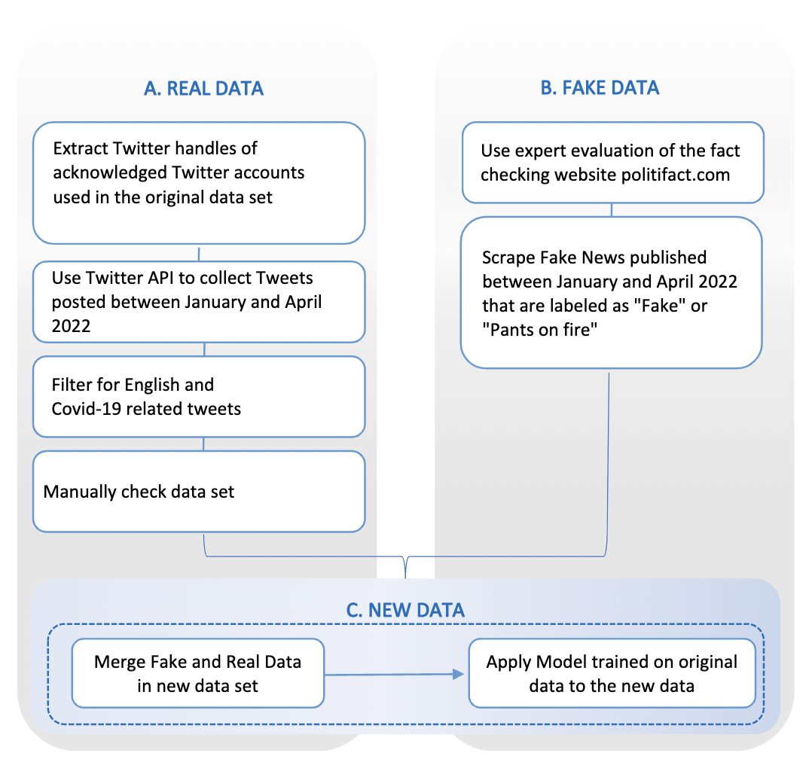
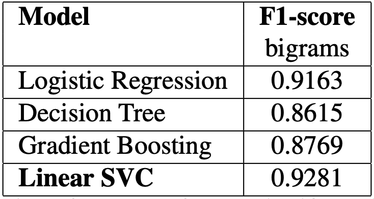
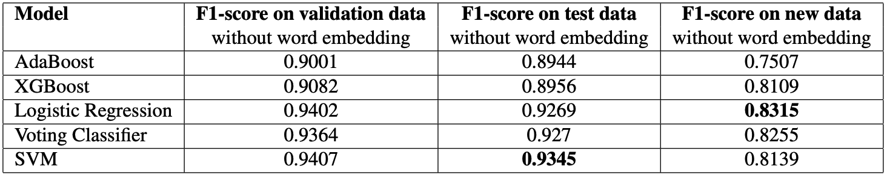
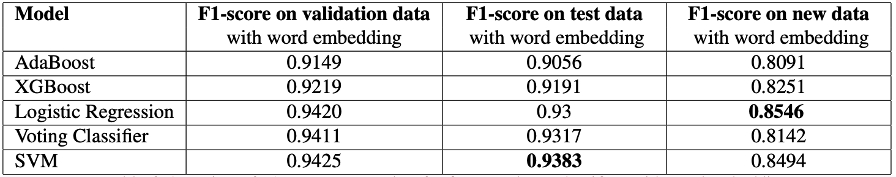

```{r setup, include=FALSE}
knitr::opts_chunk$set(echo = FALSE)

# Load dependencies 
library(reticulate) # for rendering Python code 
```

```{r, eval = TRUE, echo = FALSE, out.width = '100%'}

```

## Abstract 

Fake news represents one of the most pressing issues faced by democracies in the digital age. While there have been many examples of fake news consumption leading to the adoption of inaccurate beliefs and harmful behaviors, fake news regarding the Covid-19 pandemic is especially dangerous due to its potential to impact public health outcomes. 

While machine learning has advanced our ability to identify and root out fake news, this approach is not without its limitations. Due to the constantly evolving nature of fake news, a fake news detection algorithm which is highly effective at one point in time may perform significantly worse later in time. This blog post describes the approach we took in our project and complements our final report which centers on the following question: **To what extent does the fast-moving nature of fake news represent a limitation for fake news detection algorithms?**

To answer this question, we construct our own fake news detection algorithm using the existing [Covid-19 Fake News dataset](https://paperswithcode.com/dataset/covid-19-fake-news-dataset) which comprises 10,700 Covid-related social media posts which have been labeled either “real” or “fake.” Our model achieved a score of 93.5% when applied to social media posts from the same time period as the one on which it was trained, and received a score of 81.4% when applied to more recent social media posts. This roughly 10% decrease in performance supports our assumption that fake news detection algorithms degrade over time, albeit less quickly than we initially anticipated. 

<aside>
The code for our project can be accessed [here](https://github.com/smkerr/COVID-fake-news-detection).
</aside>

## Background

Misinformation has always been a threat to society and democracy. Today, this danger is fueled by the potential of its rapid diffusion through social media. Machine learning (ML) and Natural Language Processing (NLP) enable us to detect fake news so that we might warn the reader and raise awareness about misinformation. This blog post will therefore present our work on the identification of such Fake News on social media platforms.

While some ML models are already very efficient at classifying whether news is real or fake, such models still face limitations. ML models are often bound to the data upon which they were originally trained, which is why the fast-moving nature of online content could degrade their effectiveness. Seeing as fake news is highly influenced by current events, we want to test the assumption that temporally rigid training sets are prone to a decline in effectiveness. As a current, politicized, and highly relevant topic, Covid-19 has created room for misinformation and intentional manipulation in social media, thereby representing an interesting case study.

This blog post will walk you through the two main components of our work:

1. Building a fake news detection algorithm with a high level of effectiveness using the [Covid-19 Fake News dataset](https://paperswithcode.com/dataset/covid-19-fake-news-dataset).
2. Applying our fake news detection algorithm to more recent data which we have collected ourselves. In this stage, we address the aforementioned issue of the time- and context-related decline in model performance.

## Related Work 

As mentioned in the introduction, the idea for the first part of our project is based on the paper of *Patwa et al.* [@patwa2021fighting] which provided a good starting point for our further experimenting with the original and the new dataset. They achieve their best result with a Support Vector Machine classifier, scoring 92.8%.

The literature offers many similar approaches, for example, *Varma, Rajshree et al.* conducted a review of various ML and Deep Learning methods applied to the same topic coming to the conclusion that "Naive Bayes, Support Vector Machine, and Logistic regression are the most widely used supervised ML algorithms for developing fake news detection models" [@varma2021systematic].

We hypothesized that there would be a reduction in the predictive power of our model over time. This assumption was based on previous research on the phenomenon of "concept drift" [@horne2020]. We assume that fake news constitutes non-stationary data whose characteristics might shift over time and thus a model trained on current data cannot provide long term reliable prediction which would pose a threat to the application of such models.

## Proposed Method 

In order to measure concept drift, we require datasets from two distinct time periods. We use the [Covid-19 Fake News Detection](https://paperswithcode.com/dataset/covid-19-fake-news-dataset) dataset to train our model and to baseline its performance. We then apply our algorithm to a dataset we’ve created ourselves which contains Covid-related social media posts from early 2022 in order to determine the extent to which our model’s performance declines over time. Here’s a sample tweet to demonstrate our approach. 

```{r, eval = TRUE, echo = FALSE, out.width = '100%', fig.cap = "Sample Tweet"}

```

Our sample tweet comes from U.S. Representative Chip Roy who characterizes Pfizer's request for vaccine authorization for children younger than five as having "zero basis in science." Experts from PolitiFact, a widely recognized fact-checking site, assign this claim a "Pants on Fire!" rating which corresponds to statements which are inaccurate and make ridiculous claims.

```{r, eval = TRUE, echo = FALSE, out.width = '100%', fig.cap = "PolitiFact Rating"}

```

We will use this tweet to illustrate our pre-processing pipeline. 

```{python, echo=TRUE}
# sample tweet
tweet = "Literally using the force of government and the culture of fear to jab children under 5 - with zero basis in science - to make billions of dollars. Shameful, @pfizer."
```

In order to extract useful information from our text data, we first pre-process the social media posts. This process involves lower-casing, tokenizing, stop word removal, and lemmatization. The motivation here is to reduce the contents of each tweet in such a way that we maximize the amount of useful information while minimizing the amount of noise. Here’s what pre-processing looks like when applied to our sample tweet. 

```{python, eval=TRUE, echo=FALSE, message=FALSE, warning=FALSE, error=FALSE}
import re
import nltk
from nltk.corpus import stopwords
nltk.download('stopwords')
from nltk.stem.wordnet import WordNetLemmatizer
nltk.download('wordnet')
stoplist = set(stopwords.words('english')) # create stop word list
lemmatizer = WordNetLemmatizer() # initializer lemmatizer 
```

```{python, echo=TRUE}
# original tweet
print(tweet)

tweet_lower = tweet.lower() # lowercase 
print(tweet_lower) # display results

tweet_tidy1 = re.sub(r"http(\S)+",' ', tweet_lower) # remove URLs   
tweet_tidy2 = re.sub(r"www(\S)+",' ', tweet_tidy1) # remove URLs
tweet_tidy3 = re.sub(r"&",' and ', tweet_tidy2) # replace & with ' and '
tweet_tidy4 = tweet_tidy3.replace('&amp',' ') # replace &amp with ' '
tweet_tidy5 = re.sub(r"[^0-9a-zA-Z]+",' ', tweet_tidy4) # remove non-alphanumeric characters
print(tweet_tidy5) # display results

tweet_token = tweet_tidy5.split() # tokenize 
print(tweet_token) # display results

tweet_stop = [w for w in tweet_token if not w in stoplist] # remove stop words
print(tweet_stop) # display results

tweet_lem = [lemmatizer.lemmatize(w) for w in tweet_stop] # lemmatize 
print(tweet_stop) # display results

tweet_processed = " ".join(tweet_lem) # joins the list of words
print(tweet_processed) # display end product
```

Once the text data has been pre-processed, we begin to extract the features upon which we will train our model. Since computers can’t understand words, we translate our text data into numerical data. We use *sklearn*’s CountVectorizer to create a matrix containing information on the number of times a word appears where each row represents a single social media post and each column represents a word contained in the dataset. Here’s what that looks like for a dataset of four fake social media posts. 

```{python, eval=FALSE, echo=TRUE}
# create corpus of tweets
corpus = ["Literally using the force of government and the culture of fear to jab children under 5 - with zero basis in science - to make billions of dollars. Shameful, @pfizer.",
          "Dr. Anthony Fauci said lockdowns are a method for coercing people to comply with COVID-19 vaccinations.",
          "The drug labels for the Pfizer COVID-19 vaccine 'were blank when they should have contained all these diseases and adverse events' listed in a confidential report.",
          "Pfizer paid '$2.8 million bribe payment' to the FDA for COVID-19 vaccine approval."]

# count vectorizer
cv = CountVectorizer() # count term frequency

# fit & transform tweet into count vector
count_matrix = cv.fit_transform(corpus_clean)

# convert count matrix to data frame
count_array = count_matrix.toarray()
tweet_cv_df = pd.DataFrame(data=count_array,columns = cv.get_feature_names())

# display count matrix
tweet_cv_df.head() 
```

```{r, eval=TRUE, echo=FALSE, out.width='100%', fig.cap="Count Matrix"}
knitr::include_graphics("figures/count-matrix.png")
```

While simply creating a data frame of term frequencies may be sufficient, we can improve upon this with a technique known as term frequency-inverse document frequency or TF-IDF for short. While the acronym is a bit of a mouthful, the concept is quite simple. In plain terms, TF-IDF takes a count matrix like the one we just created as input and weights each term by how frequently that term appears in the overall collection of tweets. Words which are used infrequently are weighted more than words which are commonplace. For example, the word “Covid” appears frequently in our dataset, so it would receive a higher weighting than a less common word such as “Ivermectin.” As such, we are telling the computer to pay special attention to words which are less common. Here’s what that looks like using the example from above. 

```{python, eval=FALSE, echo=TRUE}
# TF-IDF transformer
tfidf = TfidfTransformer() # weight counts by word frequency

# fit & transform count matrix to TF-IDF matrix
tweet_tfidf = tfidf.fit_transform(tweet_cv)

# convert to data frame
tfidf_array = tweet_tfidf.toarray()
tweet_tfidf = pd.DataFrame(data=tfidf_array,columns = cv.get_feature_names())

# display TF-IDF matrix
tweet_tfidf.head()
```

```{r, eval = TRUE, echo = FALSE, out.width = '100%', fig.cap = "TF-IDF Matrix"}
knitr::include_graphics("figures/tfidf-matrix.png")
```

Next, we extract additional features from our text data by converting each word to a numerical representation of that word’s meaning, also referred to  as a “word vector.” To accomplish this, we use [GloVe](https://nlp.stanford.edu/projects/glove/), an unsupervised learning algorithm which has been trained to encode the co-occurrence probability ratio between two words as vector differences. Essentially, this enables the computer to derive meaning from different words. Since training our model on each and every word in our dataset was deemed too computationally expensive, we instead compute one word vector for each social media post by averaging the word vectors from each word contained in that post. Here’s what that process looks like. 

```{python, eval=FALSE, echo=TRUE}
import spacy 
nlp = spacy.load("en_core_web_md") # load reduced word vector table with 20k unique vectors for ~500k words

# create list of word vectors
word2vec_list = [nlp(doc).vector.reshape(1,-1) for doc in corpus]

# join word vectors
word2vec_data = np.concatenate(word2vec_list) 

# convert to data frame
word2vec_df = pd.DataFrame(word2vec_data) 
```

```{r, eval = TRUE, echo = FALSE, out.width = '100%', fig.cap = "Word Vectors"}

```

Now that we’ve extracted features from the text data, it’s time to train our fake news detection algorithm. To do so, we tested several common classification algorithms and used the best one as our baseline. This served as a starting point for the further finetuning of the classifiers on the validation data.

Once we have tuned and tested our models, we apply our best model to our more recent data set to compare the performance. In doing so, we test our hypothesis by evaluating the extent to which concept drift (and possibly other factors) have degraded the quality of our fake news detection algorithm.

```{r workflow, eval = TRUE, echo = FALSE, out.width = '100%', fig.cap = "Workflow"}
knitr::include_graphics("figures/Diagramm_v2.png")
```

## Experiments 

**Original Data**: We use the Covid-19 Fake News Detection dataset created in 2020 by *Patwa et al.* and featured in the Constraint\@AAAI2021 competition [@patwa2021fighting].^[The competition can be accessed here: https://competitions.codalab.org/competitions/26655] The dataset comprises 10,700 social media posts from various platforms including Twitter, Facebook, and Instagram. All content is related to the topic of Covid-19 and only English content is considered. Each post contains a falsifiable statement which has been labeled either "real" or "fake." 

```{python}
import pandas as pd
train_df = pd.read_csv('https://raw.githubusercontent.com/smkerr/COVID-fake-news-detection/main/data/original-data/Constraint_Train.csv', header=0)
train_df.head()
```


*Patwa et al.*'s Covid-19 Fake News Detection dataset has already been split into training (60%), test (20%), and validation sets (20%). The dataset is approximately balanced between real (52.3%) and fake (47.7%). Details regarding the distribution of real and fake posts across training, test, and validation sets can be found in Table 1.

```{r fig2, eval = TRUE, echo = FALSE, out.width = '100%', fig.cap = "Dataset composition before pre-processing"}
knitr::include_graphics("figures/Table_1.png")
```

"Fake" claims are collected from various fact-checking websites such as PolitiFact, Snopes, Boomlive, etc. and from tools like Google fact-check-explorer and IFCN chatbot. "Real" claims include tweets from credible and relevant Twitter accounts such as the World Health Organization (WHO) and the Centers for Disease Control and Prevention (CDC) among others. 

We acknowledge the shortcomings associated with sourcing "real" data exclusively from Twitter while sourcing "fake" data from various social media platforms. To correct for this, we remove all social media posts exceeding Twitter's 280 character limit from the dataset during pre-processing in an effort to make the "real" and "fake" data more comparable. While this did reduce the total number of observations, the amount of data is still sufficient to proceed. Moreover, we maintain the roughly equal split between real (49.1%) and fake (50.9%) social media posts in the dataset. See Table 2 for a more detailed breakdown.

```{r, eval = TRUE, echo = FALSE, out.width = '100%', fig.cap = "Dataset composition after pre-processing"}
knitr::include_graphics("figures/Table_2.png")
```

To familiarize ourselves with the data and to detect potential biases, we conducted an exploratory analysis. Our analysis revealed that the number of characters (Figure 3) and the number of words (Figure 4) are approximately balanced between real and fake posts.

```{r, eval = TRUE, echo = FALSE, out.width = '100%', fig.cap = "Characters per tweet"}
knitr::include_graphics("figures/Character_per_tweet.png")
```

```{r, eval = TRUE, echo = FALSE, out.width = '100%', fig.cap = "Words per tweet"}
knitr::include_graphics("figures/Words_per_tweet.png")
```

Additionally, we examined high-frequency words (Figure 2) for both fake and real claims to gain further insight into the data. No significant discrepancies could be identified. 

```{r, eval = TRUE, echo = FALSE, out.width = '100%', fig.cap = "Word frequency"}
knitr::include_graphics("figures/Word_frequency.png")
```

Lastly, we used part-of-speech tagging (Table 2) to gain a deeper understanding of the tweets. Besides a slight imbalance in the frequency of nouns between the real (51.3%) and fake (59.7%) posts, the overall balance gave no indication of significant biases in the dataset (Table 3).

```{r, eval = TRUE, echo = FALSE, out.width = '100%', fig.cap = "POS Tag Counts"}
knitr::include_graphics("figures/Table_3.png")
```

In sum, our exploratory analysis did not uncover any significant underlying issues with the Covid-19 Fake News Detection dataset, thereby allowing us to proceed with our project. 

**New data**: For the second part of the project, we created our own dataset of more recent fake and real posts which were published between January and April 2022. We employed methods which closely mirror those used in the original paper by *Patwa et al.* so as to ensure that our dataset is comparable to the original dataset in all aspects aside from time period. Thus, we collected tweets from the same Twitter accounts and used Politifact.com as a source for fake news, as the authors did for the original dataset. 

While the authors of the original dataset did use additional fact-checking sources beyond PolitiFact when compiling fake claims such as Snopes, Boomlive, and Google fact-check-explorer among others, due to time constraints, our project only used data from PolitiFact.com. Despite this, we were still able to create a large enough dataset to draw conclusions. In the creation of our dataset, we took special care to maintain an equal share of fake and real posts within the dataset (the final new dataset contains 100 real and 100 fake posts). An overview of the data collection process is provided in Figure 5.

```{r fig8, eval = TRUE, echo = FALSE, out.width = '100%', fig.cap = "Data collection workflow"}

```

**Evaluation method**: The fake news detection algorithm that we build during the first part of our project is evaluated using a F1-score. We consider our fine-tuned model to be successful if it achieves a higher F1-score than our baseline model which received a F1-score of 0.9281. The F1-score is one of the most important measures for a machinefor machine learning model's effectiveness as it provides a harmonic mean of precision and recall.
In this formula, $TP$ represents True Positives (i.e., real posts correctly classified as real), whereas  $FP$ represents False Positives (i.e., fake posts which were wrongly classified as real) and the $FN$ represents False Negatives (i.e., real posts which were wrongly classified as fake).
 
The F1-score is also present in the second part of our project where we attempt to quantify the amount of "concept drift" associated with Covid-related fake news. As explained in Section 3: Proposed Methods, we apply our fine-tuned fake news detection algorithm which was developed during the first part of the project to both the original dataset and the new dataset which we have created ourselves. The difference between the two F1-scores indicates the magnitude of the concept drift associated with Covid-related fake news between the two time periods in which the datasets were created.

While we acknowledge that there are several reasons which could explain the difference in F1-scores such as inconsistencies in the way both datasets were created, we believe that any gap between the two F1-scores contains valuable information regarding the magnitude to which concept drift may be present. 

**Software**: The project was conducted using the Python programming language. Besides fundamental Python packages such as pandas and *numpy*, we use *scikit-learn* for pre-processing text data, performing grid searches, training ML classifiers, and displaying results. Additionally, our *XGBoost* models were based on the  open-source software library of the same name. *NLTK* is used for NLP-related tasks such as pre-processing text data. *SpaCy* is used for additional NLP-related techniques which, in turn, relied upon the GloVe pre-trained word vectors for extracting word embeddings from the text data. Additionally, the *HyperOpt* package was used for hyper-parameter optimization. Furthermore, we used Google Colab for drafting our code, GitHub for version control and collaboration, as well as Overleaf for project documentation.

**Experimental details**: When creating our baseline model, we selected off-the-shelf models including Logistic Regression, Decision Tree, Gradient Boosting, and Linear SVC classifiers. We used default parameters for all models when identifying the most highest-scoring model (based on on F1-score) to serve as our baseline. 

For the word embedding feature extraction process, we relied upon *SpaCy*'s English-language reduced word vector table with 20,000 unique vectors for nearly 500,000 words which was derived from pre-trained word vectors from the GloVe Common Crawl. Through this process, a vector of 300 dimensions was generated based on the text inputs of each individual tweet. These were transformed into feature columns and used to improve our model beyond what would be possible using only TF-IDF features.

When it came to fine-tuning our own model to out-perform the baseline model, we performed an optimization of hyperparameters for the feature extraction by using a grid search with the default 5-fold cross validation and scored based on the F1-score metric. 

After fine-tuning the individual classifiers we also combined them all into a Voting Classifier. The voting decisions are based on class probabilities of the different classifiers (i.e., soft voting).

**Results**: To create our baseline, we fit Logistic Regression, Decision Tree, Gradient Boosting and Linear SVC classifiers to our training set. Table 4 provides an overview of the quantitative performance of our baseline models. The Linear SVC classifier reached the highest F1-score with 0.9281 on the test set.

```{r, eval = TRUE, echo = FALSE, out.width = '100%', fig.cap = "Overview of F1-scores for ML classifiers without parameter tuning"}

```

By fine-tuning our models we beat our baseline model. The SVM classifier outperformed the other models with a F1-score of 0.9345.

```{r, eval = TRUE, echo = FALSE, out.width = '100%', fig.cap = "Overview of F1-scores on test data for fine-tuned ML classifiers without word embedding"}

```

And when we include word embedding the SVM classifier achieved an F1-score of 0.9383. Even though including word embeddings improved our model, it drastically increased the runtime as it naturally enlargened the dataset.

```{r fig11, eval = TRUE, echo = FALSE, out.width = '100%', fig.cap = "Overview of F1-scores on test data for fine-tuned ML classifiers with word embedding"}

```

The table also shows the results for testing the models on our new dataset. The SVM scores a result of 0.8494 on the new data. The Logistic Regression classifier performs slightly better than SVM, obtaining an F1-score of 0.8546 when applied to the new dataset. Overall, the F1-score dropped by more or less 0.1 for all of the models when applied to the new data.

The addition of the word embeddings improved the F1-score across the board for all classifiers and all datasets. Thus, word embedding has once again proven their capability of boosting the performance of ML classifiers when it comes to NLP tasks.

On the contrary, the performance of the Voting Classifier is worse than expected since it doesn't exceed the SVM classifier. Overall, we have experienced constraints in tuning classifiers by conventional means. Solutions to achieve further improvements, like word embedding, required more extensive pre-processing, which is, by its very nature, more computationally expensive.

## Analysis 

For further analysis we created scattertext plot^[Package Repository can be accessed here: https://github.com/JasonKessler/scattertext] visualizing which words and phrases in the training set correspond more often with real or fake tweets. The $x$- and $y$-axes are dense ranks for the mostly associated terms with regard to their association with real and fake tweets respectively. One element that can be observed in the plot is that some terms which often correspond with real news (blue) are associated with India, while terms relating to American presidents are more often associated with fake news. 

It can also be observed that certain terms with a high association are hashtags or even Twitter handles (e.g. indafightscorona), which might suggest that models base their classification on them. 

```{r, eval = TRUE, echo = FALSE, out.width = '100%', fig.cap = "example for dangerous fake news"}
knitr::include_graphics("figures/scatterplot_training_data.png")
```

Figures 7 and 8 present a random sample of the social media posts which were misclassified by our algorithm when applied to the test set. By manually analyzing them we could not detect a clear pattern that characterizes the false negatives and positives. 

However, it is remarkable that fake social media posts which were misclassified as true are not easily classifiable as fake news but would require expert knowledge or further research. One reason for this is the occurrence of words like "cases" or "details" that are associated with real news and also appeared more often in the real posts from the training data. (Figure 9 in the Appendix provide an overview of the quantity of words in fake and real news for the new dataset)

**Ethics**:
Even the best model will always contain a rate, however small, of misclassified statements. It is therefore essential that even if the application of our model could achieve an overall improvement of readers' insights in fake news,  this aspect is kept in mind before deploying the model in a real-world context.

## Conclusions

After achieving a relatively high performance of 0.9383 with SVM, the predictive power was reduced quite strongly when we applied it to our new fake and real news dataset (0.8494). We assume that this reduction, however, is not exclusively attributable to the concept drift (for example, there might be words in the new dataset that were not present in the training set). However, based on previous research on this, we suspect that concept drift strongly contributes to the prediction loss on the new data.

This blog post provided an overview of our work including setting up our end-to-end machine learning project, working with the Twitter API, web-scraping from PolitiFact's website, manipulating Python data structures as well as other aspects of the Python programming language.

## Acknowledgements

We thank *Dipta Das et al.* for providing the CONSTRAINT-2021 dataset which we used to train and test our models as well as used as a benchmark for our new data [@dipta2021heuristic]. 